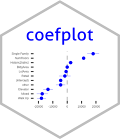
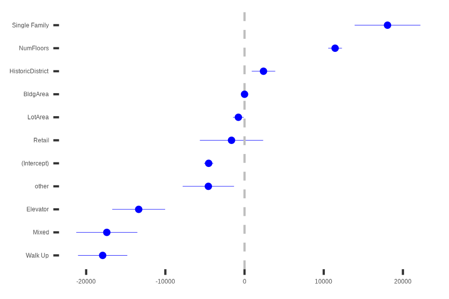

<!-- README.md is generated from README.Rmd. Please edit that file -->

# coefplot 

<!-- badges: start -->

<!-- badges: end -->

Coefplot is a package for plotting the coefficients and standard errors
from a variety of models. Currently `stats::lm()`, `stats::glm()`,
[`parsnip`](https://parsnip.tidymodels.org/) and
[`workflows`](https://workflows.tidymodels.org/) fitted models,
`glmnet::glmnet()`, `maxLik::maxLik()`, `RevoScaleR::rxLinMod()`,
`RevoScaleR::rxGLM()` and `revoScaleR::rxLogit()` are supported.

The package is designed for S3 dispatch from the functions coefplot and
getModelInfo to make for easy additions of new models.

If interested in helping please contact the package author.

## Example

